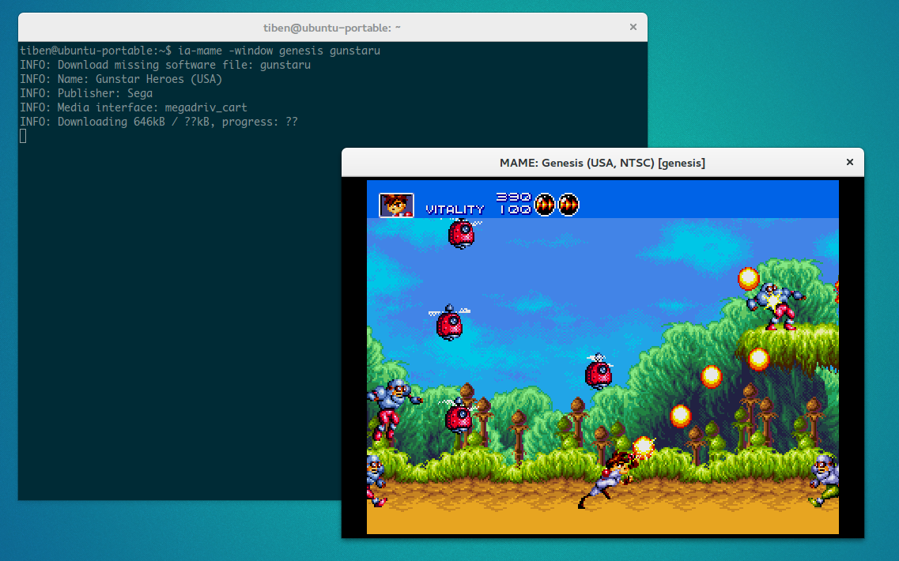
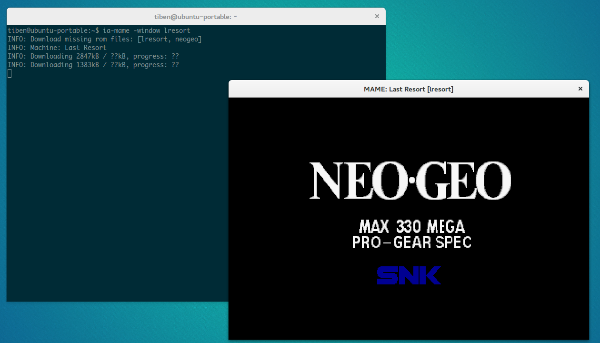
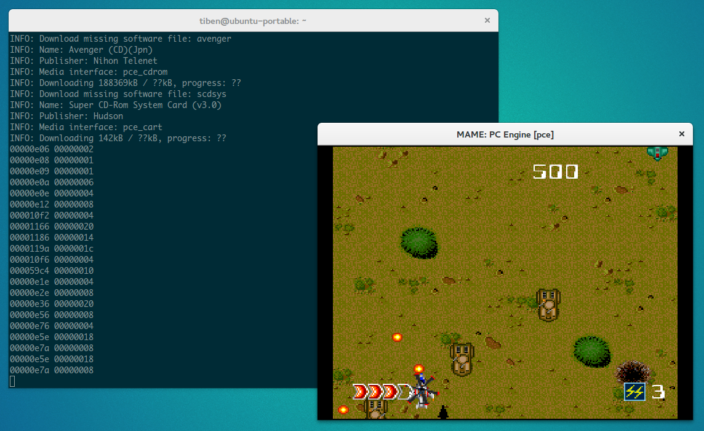

ia-mame
=======

`ia-mame` allows you to play with the [MAME](http://mamedev.org/)
emulator without bothering to find roms: `ia-mame` searchs and downloads
them automatically for you!

Machines ROMs/CHDs and software lists ROMs/CHDs are supported. Files are
downloaded from [romset
collections](https://archive.org/details/messmame) hosted at
[archive.org](https://archive.org). `ia-mame` is really handy for casual
gamers or others Mame users that don't want to spend time, energy or HDD
space in collecting perfect full romsets but simply want to play or
quickly test some games. As a nice side effect, `ia-mame` allows the
download of only parts of bigs zipped romsets files available at
archive.org. Some users complained about issues in downloading theses
big files.

Watch the following screencast made by [Geoff
Yuen](https://vimeo.com/user51410922) to see `ia-mame` in action!:

Prerequisites
-------------

-   [Java](https://www.java.com/fr/download/) 1.8+.

    Mac OS x Users: Some users reported issues to install Java Superior
    to 6. If it is you case, read this [Stack Overflow
    thread](http://stackoverflow.com/questions/12757558/installed-java-7-on-mac-os-x-but-terminal-is-still-using-version-6).

-   A version of [Mame](http://mamedev.org/release.php) 0.149+ that
    suits your operating system. Make sure Mame is correctly installed
    and works as expected before trying `ia-mame`. Recommended version
    is one that match exactly one of the [available romsets at
    archive.org](https://archive.org/details/messmame?&sort=publicdate).
    As of now, available romsets range from 0.149 to 0.197. So
    recommended version is 0.197. If your Mame version does not match
    exactly a romset version, `ia-mame` searchs for roms in greatest
    romsets version less than your Mame version. In this case, some
    required files may be missing. Its a hit or miss but works pretty
    well if the version delta between Mame and romsets is not too high.
    Previous versions of Mame are available
    [here](http://mamedev.org/oldrel.html).

Warning
-------

Despite `ia-mame` can be considered safe, it is for now a beta software.
It should not affect your roms collection and will not overwrite your
existing files. But if you take care of your collection, it would be
safer to try `ia-mame` with another rompath. See
[below](https://github.com/TiBeN/ia-mame#use-a-different-rompath)

If you change your version of Mame, i recommend you to use another empty
rompath to prevent a `mixed versions romset`. Some roms could have been
changed from a romset version to another so it is safer to download them
again.

Installation
------------

### Linux / OS X

-   Make your rompath writable or add another writable one on the
    'rompath' directive of `mame.ini`

        $ chmod +w /path/to/mame/roms

-   Install `ia-mame` and make it executable:

        $ sudo curl -fsSLo /usr/local/bin/ia-mame https://github.com/TiBeN/ia-mame/releases/download/0.9/ia-mame
        $ sudo chmod +x /usr/local/bin/ia-mame

-   Tell `ia-mame` where is your Mame executable by making it available
    on your \$PATH environment variable — its name must match
    mame\[64\]\[.exe\] — or by setting on your \~./bashrc, or
    \~/.bash\_profile or somewhere else, the \$MAME\_EXEC environment
    variable:

        $ vim ~/.bashrc
        export MAME\_EXEC=/path/to/mame64

### Windows

-   Download
    [ia-mame.exe](https://github.com/TiBeN/ia-mame/releases/download/0.9/ia-mame.exe)
    and place it on the folder where is your mame.exe

You can alternatively place it somewhere else and use the \$MAME\_EXEC
env variable:

    C:\> SET MAME_EXEC=C:\Users\tiben\mame\mame.exe

### Compilation from the sources

The compilation requires `Maven`.

-   git clone this repository:

        $ git clone https://github.com/TiBeN/ia-mame

-   Build and package using maven:

        $ cd /path/to/ia-mame
        $ mvn package

The binary files `ia-mame` (Linux/OS X) and `ia-mame.exe` (Windows) and
the executable jar are available on the `target` directory.

Usage
-----

`ia-mame` acts like a `command wrapper` of the original Mame executable.
Use it exactly like the original Mame command line. When you launch a
game or a system, `ia-mame` looks at your rompath to determine what
ROM/CHD files are missing and downloads them from archive.org into your
rompath. Once the files are downloaded, it returns control to original
Mame executable which launches the game/system.

### Linux, Os X

Let's try `The King Of Fighters '98`. Simply type what you would have
typed with the original Mame to launch the game:

    $ ia-mame kof98

### Windows

Let's try Columns on the Sega Master System.

Open a console `cmd` then type:

    C:\> cd \path\to\mame
    C:\> ia-mame.exe sms columns

### Executable JAR

Alternatively, the provided [executable
jar](https://github.com/TiBeN/ia-mame/releases/download/0.9/ia-mame.jar)
can be used directly:

    $ java -jar ia-mame.jar sf2

### Use a different rompath

If you want to try `ia-mame` using a different rompath than your Mame's
default, you can use the original Mame option `-rompath` on the
command-line.

    $ ia-mame -rompath /tmp sms sonic

### Disable Mame execution

It is possible to run `ia-mame` without running Mame afterward using the
`-noexecmame` option. This can be useful if you only want to download a
rom file without execute the game. If the rom is already available,
`ia-mame` simply does nothing.

    $ ia-mame -noexecmame sms sonic

Known limitations
-----------------

### No GUI support

`ia-mame` does not work when used with the included Mame GUI. However it
should work with frontends using some tweaks. Reddit user `jstefa`
managed to make [`ia-mame` work in his
cab](https://www.reddit.com/r/MAME/comments/4fruod/iamame_05_mame_thin_wrapper_which_downloads/d4tn8ed/)
with the frontend [attract-mode](http://attractmode.org/).

### Some ROMs/CHDs are missing

`ia-mame` relies on [romsets
available](https://archive.org/details/messmame?&sort=publicdate) at
archive.org\]. Not all romsets for all Mame versions are hosted and some
versions miss parts like softwarelist or chd sets. `ia-mame` tries to
find missing roms in previous collections but olders roms may not work
with a more recent version of Mame.

Contact and contributions
-------------------------

If you want to contribute or simply share your thoughs about `ia-mame`
feel free to send your pull requests here at github or join me at
[reddit](https://www.reddit.com/user/tiben_/).

One really simple contribution is keep me informed when new romsets are
hosted at archive.org.

Discussions
-----------

Releases announces on reddit triggered some good discussions:

-   [0.5 on
    /r/MAME](https://www.reddit.com/r/MAME/comments/4fruod/%60ia-mame%60_05_mame_thin_wrapper_which_downloads/)
-   [0.7 on
    /r/emulation](https://www.reddit.com/r/emulation/comments/4tkrqb/%60ia-mame%60_07_released/)

