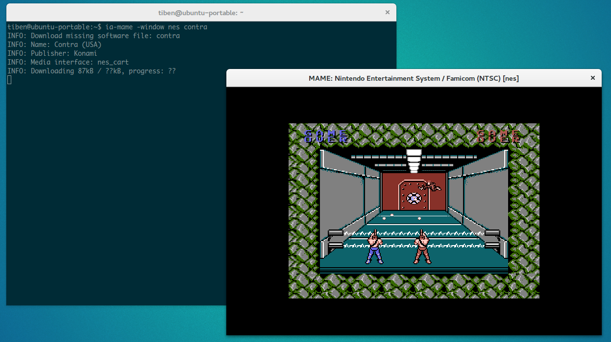
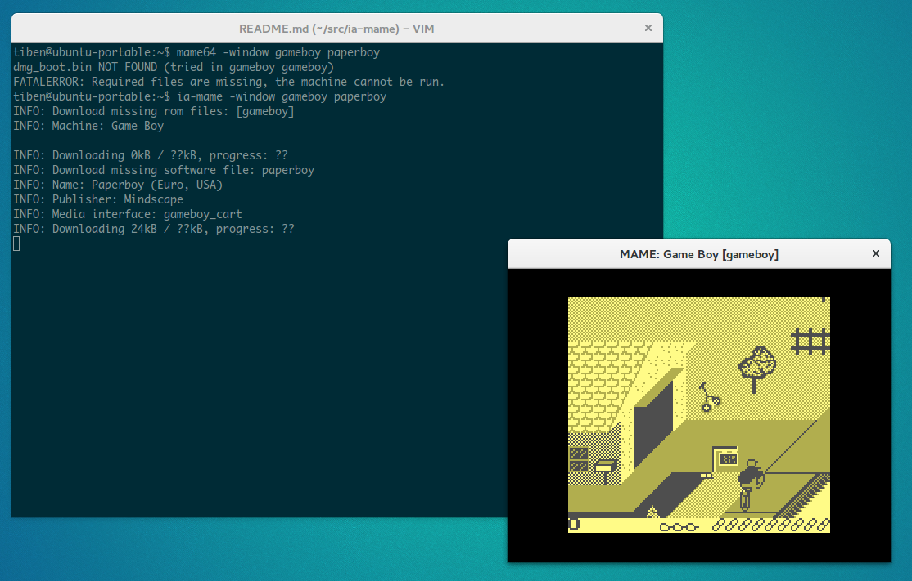

IaMame
======

[](https://travis-ci.org/TiBeN/ia-mame)

IaMame is a thin [Mame](http://mamedev.org/) emulator command line wrapper 
which downloads automatically needed system roms and softwares from 
[The Internet 
Archive Mess and Mame collections](https://archive.org/details/messmame) 
if they are missing on the rompath directory before launching Mame.

Mame roms and CHD, softwarelist roms and most of cd-rom CHD collections are
supported.


Prerequisites
-------------

- [Java](https://www.java.com/fr/download/) 1.7+. 

  Mac OS x Users: Some users reported issues to install Java Superior to 6. 
  If it is you case, read this [Stack Overflow 
thread](http://stackoverflow.com/questions/12757558/installed-java-7-on-mac-os-x-but-terminal-is-still-using-version-6)

- A version of [Mame](http://mamedev.org/release.php) that suits your 
  operating system. Make sure it works properly before trying ia-mame.
  Recommended version is 0.162 because it is the closest match with the 
  archive.org collections version. But All Mame & Mess version are 
  supported starting from 0.149 . You can use the latest Mame version
  but there should be roms mismatch dues to version differences.
  (Some workarounds are planned, see [todo](TODO.md) file)

Warning
-------

Despite ia-mame can be considered safe, it is for now a beta software.
It should not affect your beloved roms collection and will not overwrite
your existing files. But if you take care of your years tailored
collection, it should be safer to try ia-mame with an empty rompath. See
[below](https://github.com/TiBeN/ia-mame#use-a-different-rompath)

Installation
------------

### Linux / OS X

- Make your rompath writable or add another writable one on the 'rompath' 
  directive of `mame.ini`

  ```bash 
  $ chmod +w /path/to/mame/roms
  ```

- Install ia-mame and make it executable: 

  ```bash 
  $ sudo curl -fsSLo /usr/local/bin/ia-mame https://github.com/TiBeN/ia-mame/releases/download/0.7/ia-mame
  $ sudo chmod +x /usr/local/bin/ia-mame
  ```

- Tell IaMame where is your Mame executable by making it available on your 
  $PATH environment variable — its name must match mame[64][.exe] — or by 
  setting on your ~./bashrc, or ~/.bash\_profile or somewhere else, 
  the $MAME_EXEC environment variable:

  ```bash
  $ vim ~/.bashrc
  export MAME_EXEC=/path/to/mame64
  ```

### Windows

- Download
  [ia-mame.exe](https://github.com/TiBeN/ia-mame/releases/download/0.8/ia-mame.exe) and place it on the folder where is your mame.exe

You can alternatively place it somewhere else and use the $MAME\_EXEC env
variable:

```batch
C:\> SET MAME_EXEC=C:\Users\tiben\mame\mame.exe
```

### Compilation from the sources

The compilation requires Maven.

- git clone this repository:

```bash
$ git clone https://github.com/TiBeN/ia-mame
```

- Build and package using maven:

```bash
$ cd /path/to/ia-mame
$ mvn package
```

The binary files ia-mame (Linux/OS X) and ia-mame.exe (Windows) and the
executable jar are available on the `target` directory.

Usage
-----

IaMame works exactly like the original Mame command line. Simply launch a
game, ia-mame will take care to see what files are missing on your rompath
and will download them before launching Mame.

### Linux, Os X

Let's try Street Fighter 2 arcade board:

```bash
$ ia-mame sf2

INFO: Download missing rom files: [sf2]
INFO: Machine: Street Fighter II: The World Warrior (World 910522)
INFO: Downloading 3468kB / ??kB, progress: ??
```

### Windows 

Let's try Columns on the Sega Master System.

Open a console `cmd`

```batch
C:\> cd \path\to\mame
C:\> ia-mame.exe sms columns

INFO: Download missing rom files: [sms]
INFO: Machine: Master System II
INFO: Downloading 78kB / ??kB, progress: ??
INFO: Download missing software file: columns
INFO: Name: Columns (Euro, USA, Bra, Kor)
INFO: Publisher: Sega
INFO: Media interface: sms_cart
INFO: Downloading 25kB / ??kB, progress: ??
```

### Executable JAR

Alternatively, the provided 
[executable
jar](https://github.com/TiBeN/ia-mame/releases/download/0.7/ia-mame.jar) 
can be used directly:

```
$ java -jar ia-mame.jar sf2
```

### Use a different rompath

If you want to try ia-mame using a different rompath than your Mame's default,
you can use the Mame option `-rompath` on the command-line; ia-mame supports 
Mame options given as command-line arguments aswell:

```
$ ia-mame -rompath /tmp sms sonic
```

### Disable Mame execution

It is possible to run ia-mame without running Mame in the end using the 
"-noexecmame". This can be
useful if you only want to download a rom file without execute that game.
If the rom is already available, ia-mame simply does nothing.

```
$ ia-mame -noexecmame sms sonic
```

Don't like command line ?
-------------------------

If you feels not confortable with the Mame command line, i suggest you to
become familiar with it by reading the official 
[documentation](http://docs.mamedev.org/). The original [MESS
documentation](http://www.mess.org/mess/howto) can be pretty useful too to 
better understand the softwarelist mechanism and knowing which `<system>` 
and `<software>` names to type. Mess is now merged with Mame but was 
previously the console/computer part of Mame. 

What's more, i'm planning to do a very rudimentary GUI to simplify things a
little for users which do not like command line, especially on Windows
environment.

I have not tested now but IaMame should be compatible with frontends, the
usage command line beeing the same as the original Mame.

Some screenshots
----------------





